 <h1 align="center"> Hola, I'm Suryan</h1>
<h3 align="center">Working to inspire and change the world, epoch by epoch</h3>

<picture>
  <source media="(prefers-color-scheme: dark)" srcset="https://raw.githubusercontent.com/suryan-s/suryan-s/output/github-contribution-grid-snake-dark.svg" />
  <source media="(prefers-color-scheme: light)" srcset="https://raw.githubusercontent.com/suryan-s/suryan-s/output/github-contribution-grid-snake.svg" />
  
</picture>

<p align="center">  </p>

<p align="center">
  <a href="https://github.com/EddieHubCommunity" target="_blank" rel="noopener noreferrer">
    
 </a>
  <a href="https://github.com/EddieHubCommunity" target="_blank" rel="noopener noreferrer">
    
 </a>
  <a href="https://github.com/EddieHubCommunity" target="_blank" rel="noopener noreferrer">
    
 </a>
</p>

- 🔭 I’m currently working on **Full-Stack based projects**

- 🌱 I’m currently learning **.NET Core and Angular**

- 💬 Ask me about **Python, C/C++, Dart/Flutter, Rust, Arduino/Raspberrypi/ESP32, IoT/IIoT**

- 📫 How to reach me **suryannasa@gmail.com suryans0405@gmail.com**

- ⚡ Fun fact **There are two ways to write error-free code. Only the third one works!**

<h3 align="left">Connect with me:</h3>
<p align="left">
<a href="https://linkedin.com/in/suryansanal" target="blank">

</a><a href="https://www.instagram.com/me_suryan/" target="blank">

</a>
</p>

<h3 align="left">Languages and Tools:</h3>

<p align="left">
  
  
  
  
  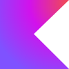
  
  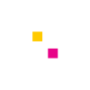
  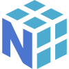
  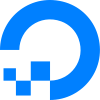
  
  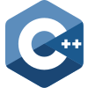
  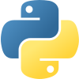
  
  
  
  
  
  
  
  
  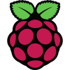
  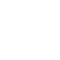
  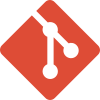
  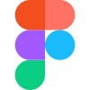
  
  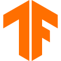
  
  
  
  
  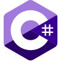
</p>

<sub>Also used: C, FastAPI, Kaggle, Arduino, Gunicorn, Jupyter Notebook, Keras, Jinja, and Matplotlib.</sub>

<p>
 
 <h3 align="left">Coding stats:</h3>

<!--START_SECTION:waka-->

```txt
From: 13 February 2023 - To: 08 October 2026

Total Time: 1,838 hrs 16 mins

Python                             695 hrs 17 mins       >>>>>>>>>----------------   37.82 %
Dart                               386 hrs 31 mins       >>>>>--------------------   21.03 %
Rust                               128 hrs 35 mins       >>-----------------------   06.99 %
TypeScript                         73 hrs 20 mins        >------------------------   03.99 %
```

<!--END_SECTION:waka-->
</p>

<p align="center">
  
  
</p>
